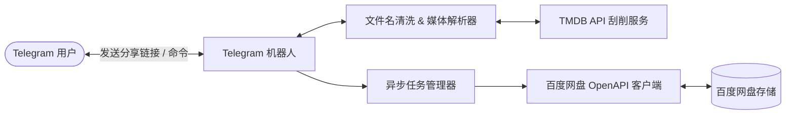

# tg-baidu 🎬 百度网盘智能转存与 TMDB 媒体重命名 Telegram 机器人

<p align="center">
  
  
  
  
</p>

`tg-baidu` 是一个现代化的 Telegram 机器人，通过百度网盘开放平台（OpenAPI / OAuth2）协议与 TMDB（The Movie Database）媒体数据库集成。

当你在 Telegram 中发送百度网盘分享链接时，机器人会自动解析链接、清洗文件名中的广告信息并在 TMDB 中匹配影视条目，根据 **Plex / Emby / Jellyfin** 媒体库命名规范自动重命名并归档保存到指定的百度网盘目录中。

---

## ✨ 核心特性

- 🤖 **Telegram 交互式体验**：
  - 自动识别消息中的百度网盘分享链接与提取码（支持各种复杂/带有说明文字的格式）。
  - 支持 Inline Keyboard 按钮交互确认（快速确认识别、切换电影/剧集分类、查看多候选结果、取消操作）。
  - 实时推送转存、重命名与归档进度及结果概览。
- 🎬 **TMDB 智能影视刮削与匹配**：
  - 内置基于 `guessit` 与定制正则的中文广告清洗算法（去除“关注公众号”、“压制组标签”、“无水印”等干扰字符）。
  - 智能识别电影与电视剧（季、集、年份、分辨率 4K/1080P 等）。
  - 支持多语言刮削（默认中文 `zh-CN`），自动抓取剧集单集标题。
- 📂 **Plex / Emby / Jellyfin 规范化整理**：
  - **电影格式**：`/Media/Movies/奥本海默 (2023)/奥本海默 (2023) [2160P].mkv`
  - **剧集格式**：`/Media/TV/繁花 (2023)/Season 01/繁花 - S01E01 - 第一集.mp4`
  - 支持在配置文件中自定义重命名模板。
- ☁️ **百度网盘开放平台 (OpenAPI) 深度集成**：
  - 标准 OAuth 2.0 授权流程与 Token 自动续期。
  - 支持账号状态与容量配额查询（`/status`）。
  - 支持批量创建文件夹、重命名与移动操作。
- 🐳 **开箱即用与容器化**：
  - 提供完整 `Dockerfile` 与 `docker-compose.yml`，一键拉起服务。
  - 使用 SQLite 本地持久化保存授权令牌、用户偏好与任务历史。

---

## 🏗️ 架构设计



---

## 🚀 快速开始

### 准备工作

在使用前，你需要准备以下三样凭证：

1. **Telegram Bot Token**：通过 Telegram 联系 [@BotFather](https://t.me/BotFather) 创建机器人并获取 Token。
2. **TMDB API Key**：在 [TMDB 官网](https://www.themoviedb.org/settings/api) 申请免费 API Key（或 Read Access Token）。
3. **百度网盘开放平台应用**：
   - 访问 [百度网盘开放平台 (Union)](https://pan.baidu.com/union/) 创建应用。
   - 获取 `AppKey` (Client ID) 与 `AppSecret` (Client Secret)。
   - 在应用回调地址中填入 `oob` 或 `https://openapi.baidu.com/oauth/2.0/login_success`。

---

### 方式一：Docker Compose 部署（推荐）

1. **克隆项目并进入目录**：
   ```bash
   git clone https://github.com/your-username/tg-baidu.git
   cd tg-baidu
   ```

2. **创建配置文件**：
   ```bash
   cp config.example.yaml config.yaml
   ```
   编辑 `config.yaml` 填入你的配置信息：
   ```yaml
   telegram:
     bot_token: "YOUR_TELEGRAM_BOT_TOKEN"
     allowed_user_ids: [123456789]  # 填入你的 Telegram User ID
     admin_user_id: 123456789

   tmdb:
     api_key: "YOUR_TMDB_API_KEY"
     language: "zh-CN"

   baidu:
     app_key: "YOUR_BAIDU_APP_KEY"
     app_secret: "YOUR_BAIDU_APP_SECRET"
     redirect_uri: "oob"

   media:
     movie_dir: "/Media/Movies"
     tv_dir: "/Media/TV"
   ```

3. **启动容器**：
   ```bash
   docker-compose up -d
   ```

4. **查看日志**：
   ```bash
   docker-compose logs -f
   ```

---

### 方式二：本地 Python 运行

1. **安装 Python 3.10+ 环境**。
2. **安装依赖**：
   ```bash
   python3 -m venv .venv
   source .venv/bin/activate
   pip install -r requirements.txt
   ```
3. **配置 `config.yaml`**（同上）。
4. **启动机器人**：
   ```bash
   python3 -m tg_baidu.main -c config.yaml
   ```

---

## 📱 使用指南

### 1. 账号授权绑定

1. 在 Telegram 中向机器人发送 `/start`。
2. 发送 `/login` 命令，机器人会返回百度 OAuth2 授权链接。
3. 在浏览器中打开链接完成登录与授权，复制页面显示的 **授权码 (Code)**。
4. 在 Telegram 中发送：
   ```text
   /code <你的授权码>
   ```
5. 机器人提示绑定成功，并显示当前网盘容量与账号信息。

### 2. 发送链接转存与整理

直接在聊天中发送百度网盘分享链接，例如：
```text
链接: https://pan.baidu.com/s/1abcdEFG12345 提取码: 8888 繁花.2023.4K.WEB-DL.H265
```

机器人将自动：
1. 提取链接和提取码 `8888`。
2. 检索 TMDB 并展示海报与匹配信息。
3. 点击 **【✅ 确认识别并转存】**。
4. 后台自动将文件转存至百度网盘临时目录，随后按照 TMDB 规则移动并重命名至 `/Media/TV/繁花 (2023)/Season 01/...`。

### 3. 可用命令列表

| 命令 | 说明 |
| :--- | :--- |
| `/start` | 欢迎信息与快速指引 |
| `/help` | 查看详细帮助信息 |
| `/login` | 获取百度网盘 OAuth2 授权绑定链接 |
| `/code <授权码>` | 提交授权码完成账号绑定 |
| `/status` | 查询百度网盘空间容量、会员状态与配置信息 |
| `/settings` | 交互式修改个人偏好（自动转存开关、目录等） |
| `/tasks` | 查看最近转存与整理任务的历史状态 |
| `/search <关键词>` | 手动在 TMDB 搜索影视条目与详情 |

---

## ⚙️ 高级配置项说明

在 `config.yaml` 中支持以下高级配置：

```yaml
media:
  # 电影重命名模板
  # 支持变量: {title}, {year}, {resolution}, {video_codec}, {audio_codec}, {ext}
  movie_format: "{title} ({year})/{title} ({year}) [{resolution}].{ext}"

  # 剧集重命名模板
  # 支持变量: {title}, {year}, {season:02d}, {episode:02d}, {episode_title}, {resolution}, {ext}
  tv_format: "{title} ({year})/Season {season:02d}/{title} - S{season:02d}E{episode:02d} - {episode_title}.{ext}"

  # 自动转存开关 (开启后识别到匹配项立即执行，无需按钮确认)
  auto_transfer: false

  # 转存并整理完成后是否自动删除临时转存文件夹
  cleanup_temp_dirs: true

system:
  # 最大并发处理任务数
  max_concurrent_tasks: 3
  # 日志级别: DEBUG, INFO, WARNING, ERROR
  log_level: "INFO"
```

---

## 🧪 单元测试

运行单元测试套件：
```bash
python3 tests/run_tests.py
# 或使用 pytest
pytest -v
```

---

## 📄 开源许可证

本项目采用 [MIT License](LICENSE) 开源许可证。
